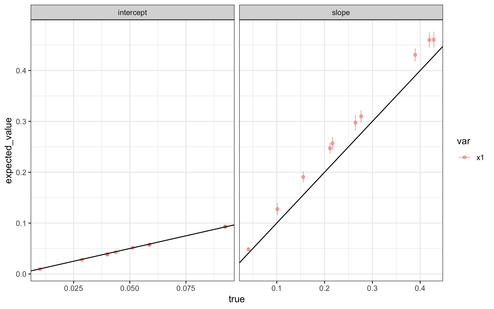

```{r setup, include=FALSE}
knitr::opts_chunk$set(echo = TRUE)
```

## Speed

At the moment, this isn't set up for speed. It's set up for clarity and verification. Use the `n_sims` parameter to adjust the size of the simulations. Adjust the `size` parameter in the `# randomly select combinations` block of code in the `**-set-pars.R` script to simulate for fewer or more parameter combinations. 

## GNU Make

This project uses multiple R scripts and a `Makefile` to build the project. 

* Build the project (i.e., run all files) by clicking *Build*, *Build All* in RStudio or
entering `make` at a terminal opened in the project directory (i.e., the one
containing .Rproj and Makefile, which is `diffusion-sims` in my case).
* Clean the project (delete all the files *created* by the code) by clicking
*Build*, *Clean All* in RStudio or entering `make clean` at a terminal opened in the
project directory.

## R Scripts

The project uses five R scripts.

1. `01-set-pars.R`: sets the parameters. It creates a data frame and each row of the data frame is a particular combination of values. Near the bottom of this script, I sample from the combinations. This allows me to take a representative sample for quick testing rather than exhaustively permuting.
1. `02-create-x.R`: creates the data frame of 10 observed explanatory variables. This script does just a bit of cleaning and rescales the variables to range from zero to one, so that the intercept equals `p_min` and the slope equals `p_max` - `p_min`.
1. `03-do-sims.R`: does the simulation for each parameter combination. It creates one csv file in `sims/` per parameter combination.
1. `04-bind-sims.R`: binds the simulations from each parameter combination into a single data set `out/sims.csv`.
1. `05-plot-sims.R`: calculates the mean and standard error for the estimates for each parameter combination and plots these against the truth.

